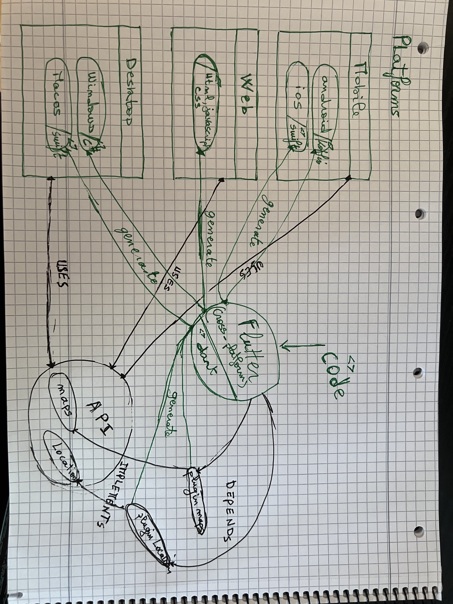
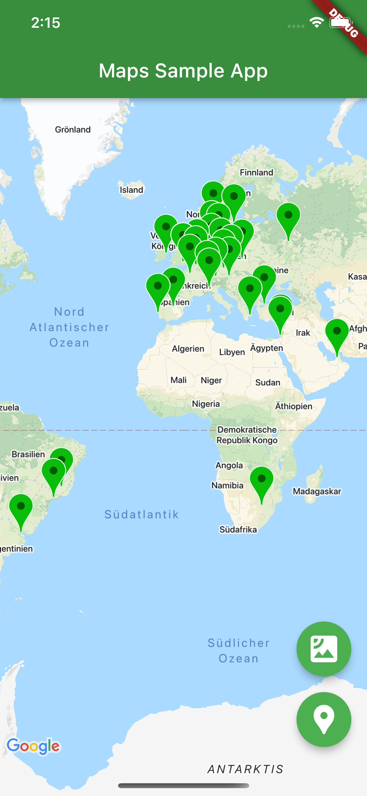
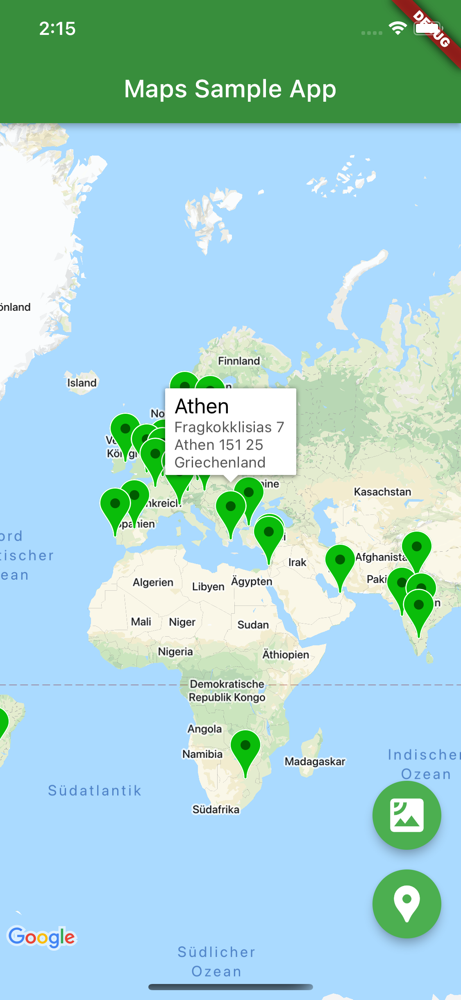
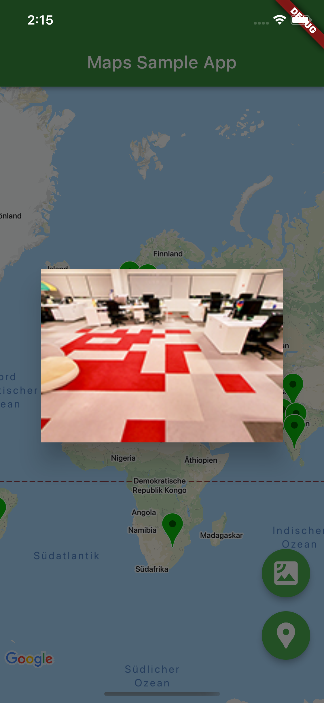
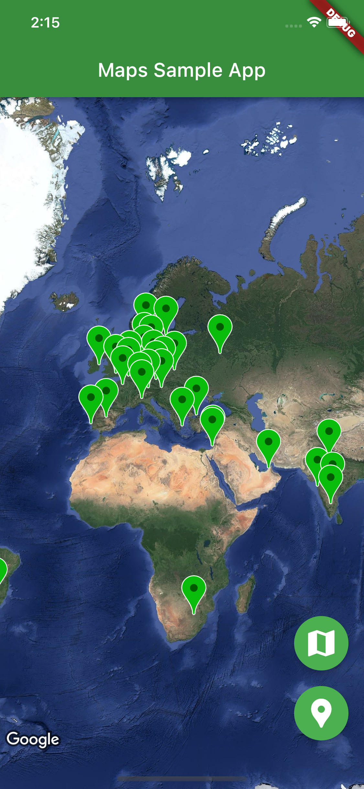
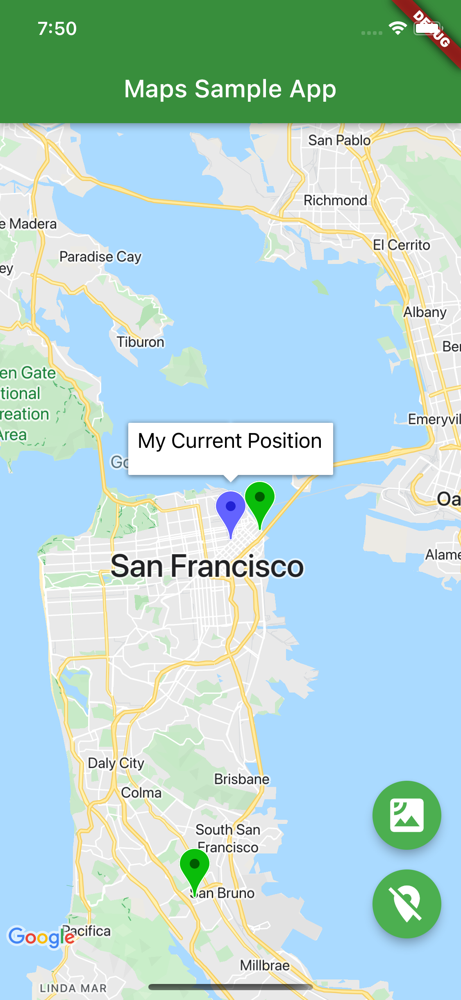

# google_maps_in_flutter

A new Flutter project.

<figure>

<figcaption>
Flutter uses plugins to communicate with each platform's native API
</figcaption>
</figure>

# Getting Started

This project is a starting point for google maps with geolocation in Flutter application .

A few resources to get you started if this is your first Flutter project:

- [Lab: Write your first Flutter app](https://flutter.dev/docs/get-started/codelab)
- [Cookbook: Useful Flutter samples](https://flutter.dev/docs/cookbook)
- [Flutter GeoLocator Plugin](https://pub.dev/packages/geolocator)
- [CodeLabs: Adding Google Maps to Flutter app](https://codelabs.developers.google.com/codelabs/google-maps-in-flutter#0)

For help getting started with Flutter, view
[online documentation](https://flutter.dev/docs), which offers tutorials,
samples, guidance on mobile development, and a full API reference.

# App Context

This is a sample of map displaying [google offices](https://about.google/static/data/locations.json) with markers.
When the map is created successfully the camera move to the current device location.

## Screenshots

# Run project

## web

Assuming you have installed [Vscode](https://code.visualstudio.com/) with these recommended
extensions :

- [Dart](https://marketplace.visualstudio.com/items?itemName=Dart-Code.dart-code)
- [Flutter](https://marketplace.visualstudio.com/items?itemName=Dart-Code.flutter)
- [Todo Tree](https://marketplace.visualstudio.com/items?itemName=Gruntfuggly.todo-tree)

Run Vscode and click `File > Open` the select the current folder `./`

Click the `Todo Tree` icon  and Fix all the FIXMEs

- `FIXME: Add your Google Maps API key` : replace `XXXXXXXXXXXXXX` with your [google maps api key](https://developers.google.com/maps/documentation/javascript/get-api-key)

run in terminal on the source folder `flutter run`

## ios

Assuming that you have installed [Xcode](https://www.freecodecamp.org/news/how-to-download-and-install-xcode/):

`File > Open select ./ios/Runner/Runner.xcworkspace`

`Product > Destination > iPhone 11 Pro`

`Product > Run`

To Use Maps to Simulate Location Awareness please read [this apple document archive](https://developer.apple.com/library/archive/documentation/IDEs/Conceptual/iOS_Simulator_Guide/GettingStartedwithiOSSimulator/GettingStartedwithiOSSimulator.html)

## android

Assuming that you have installed [Android Studio](https://developer.android.com/studio)
and installed all its required components and these recommended extensions:

- [Dart](https://plugins.jetbrains.com/plugin/6351-dart)
- [Flutter](https://plugins.jetbrains.com/plugin/9212-flutter)
- [Protocol Buffers](https://plugins.jetbrains.com/plugin/14004-protocol-buffers)

`Tools > SDK Manager` select `SDK Tools` tab and make sure `Android SDK Command-line Tools` is installed

run in terminal on the source folder `flutter doctor --android-licenses`

`Tools > Device Manager` and select `Create device` download `R` image and select it

`File > Open and select the ./android folder`

Upgrade Gradle version if necessity , use recommended and restart ...
until you had a successful build
maybe you'll need `./android/gradlew --stop`
or
`Android Studio > Preferences > Build, Execution, Deployment > Build Tools > Gradle`
and update Gradle JDK to 18
